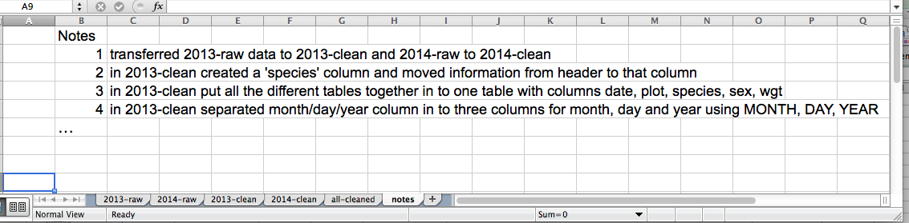

# Spreadsheets

Much of this material is modified from [the Data Carpentry lesson on Spreadsheets in Ecology](http://www.datacarpentry.org/spreadsheet-ecology-lesson/), which is released under an open license.

---

## Overview

Good **data organization** is the foundation of your research
project. Most **researchers** have data or do data entry in
spreadsheets. Spreadsheet programs are very **useful graphical
interfaces** for designing data tables and handling very basic data
quality control functions.

In this lesson, we’re going to talk about:

* Good data entry practices - formatting data tables in spreadsheets
* Dates as data
* Exporting data from spreadsheets

*Overall good data practices*

**Much of your time as a researcher will be spent in this 'data wrangling' stage.**
It's not the most fun, but it's necessary. We'll teach you how to think
about data organization and some practices for more effective data wrangling.

### Spreadsheet programs

- LibreOffice
- Microsoft Excel
- Gnumeric
- OpenOffice.org

Commands may differ a bit between programs, but general ideas
for thinking about spreadsheets is the same.

#### Questions:
- How many people have used spreadsheets in their work?
- What kind of operations do you do in spreadsheets?
- Which ones do you think spreadsheets are good for?
- What are some things that you've accidentally done in a spreadsheet,
  or have been frustrated that you can't do easily?


### Why aren't we teaching data analysis in spreadsheets

- Data analysis in spreadsheets usually requires **a lot of manual
  work**. If you want to change a parameter or run an analyses with a
  new dataset, you usually have to redo everything by hand. (We do
  know that you can create macros, but see the next point.)

- It is also difficult to **track or reproduce statistical or plotting
  analyses** done in spreadsheet programs when you want to go back to
  your work or someone asks for details of your analysis.


## Problems with Spreadsheets

Spreadsheets are **good for data entry**, but in reality we **tend to
use spreadsheet programs for much more** than data entry. We use them
to create data tables for publications, to generate summary
statistics, and make figures.

Generating **tables for publications** in a spreadsheet is not
optimal - often, when formatting a data table for publication, we’re
reporting key summary statistics in a way that is **not really meant to
be read as data**, and often involves **special formatting**
(merging cells, creating borders, making it pretty). We advise you to
do this sort of operation within your document editing software.

The latter two applications, **generating statistics and figures**, should 
be used with caution: because of the graphical, drag and drop nature of 
spreadsheet programs, it can be very difficult, if not impossible, to 
replicate your steps (much less retrace anyone else's), particularly if your 
stats or figures require you to do more complex calculations. Furthermore, 
in doing calculations in a spreadsheet, it’s easy to accidentally apply a 
slightly different formula to multiple adjacent cells. When using a 
command-line based statistics program like R or SAS, it’s practically 
impossible to accidentally apply a calculation to one observation in your 
dataset but not another unless you’re doing it on purpose. 

In this lesson, we will assume that you are most likely using Excel as
your primary spreadsheet program - there are others (gnumeric, Calc
from OpenOffice), and their functionality is similar, but Excel seems
to be the program most used by biologists and ecologists.

To remind you, in this lesson, we're going to talk about:

1. Formatting data tables in spreadsheets
2. Dates as data
3. Exporting data from spreadsheets


# 1. Formatting data tables in spreadsheets


## Learning Objectives

* Describe best practices for data entry and formatting in spreadsheets.
* Apply best practices to arrange variables and observations in a spreadsheet.

The most common mistake made is treating the program like it is a lab
notebook - that is, relying on **context**, notes in the margin,
spatial layout of data and fields to convey information. As humans, we
can (usually) interpret these things, but computers are dumb, and
unless we explain to the computer what every single thing means (and
that can be hard!), it will not be able to see how our data fit
together.

Using the power of computers, we can manage and analyze data in much more 
effective and faster ways, but to use that power, we have to set up
our data for the computer to be able to understand it (and computers are very 
literal).

This is why it’s extremely important to set up **well-formatted
tables** from the outset - before you even start entering data from
your very first preliminary experiment. **Data organization is the
foundation of your research project.** It can make it easier or harder
to work with your data throughout your analysis, so it's worth
thinking about when you're doing your data entry or setting up your
experiment. You can set things up in a different way in spreadsheets,
but it limits your ability to work with the data in other programs or
have the you-of-6-months-from-now or your collaborator work with the
data.

> **Note:** the best layouts/formats (as well as software and
> interfaces) for **data entry** and **data analysis** might be
> different. It is important to take this into account, and ideally
> automate the conversion from one to another.

### Keeping track of your analyses

When you're working with spreadsheets, during data clean up or analyses, it's
very easy to end up with a spreadsheet that looks very different from the one
you started with. In order to be able to reproduce your analyses or figure out
what you did when Reviewer #3 asks for a different analysis, **you must**:

- **create a new file or tab with your cleaned or analyzed data.** Do not modify
that original dataset, or you will never know where you started!
- **keep track of the steps you took in your clean up or analysis.** You should track 
these steps as you would any step in an experiment. You can
do this in another text file, or a good option is to create a new tab in your spreadsheet
with your notes. This way the notes and data stay together.

This might be an example of a spreadsheet setup:



Put these principles in to practice today during your Exercises. 


### Structuring data in spreadsheets

The cardinal rules of using spreadsheet programs for data:

1. Put all your **variables in columns** - the thing you're measuring,
   like 'weight' or 'temperature'.
2. Put each **observation in its own row**.
3. **Don't combine multiple pieces of information in one
   cell**. Sometimes it just seems like one thing, but think if that's
   the only way you'll want to be able to use or sort that data.
4. **Leave the raw data raw** - don't mess with it!
5. Export the cleaned data to a **text based format** like CSV. This
   ensures that anyone can use the data, and is the format required by
   most data repositories.

For instance, we have data from a survey of small mammals in a desert
ecosystem. Different people have gone to the field and entered data in
to a spreadsheet. They keep track of things like species, plot,
weight, sex and date collected.

If they were to keep track of the data like this:


the problem is that species and sex are in the same field. So, if they wanted to 
look at all of one species or look at different weight distributions by sex, 
it would be hard to set up the data to do this. If instead we put sex and species 
in different columns, you can see that it would be much easier. 


### Columns for variables and rows for observations

The rule of thumb, when setting up a datasheet, is **columns =
variables**, **rows = observations**, **cells = data** (values).

So, instead we should have:


## Exercise

We're going to take that messy version of the survey data and clean it up.

- If you don't already have it, download the data by clicking [here](https://ndownloader.figshare.com/files/2252083) to get it from FigShare.

- Open up the data in a spreadsheet program. You can see that there are two tabs. Two field assistants conducted the surveys, one
in 2013 and one in 2014, and they both kept track of the data in their own way. Now
you're the person in charge of this project and you want to be able to start doing
statistics with the data. 

- With the person next to you, work on the messy data so that a computer will
be able to understand it. Clean up the 2013 and 2014 tabs, and put them all together
in one spreadsheet. 

> **Important** Do not forget of our first piece of advice, the
> **create a new file (or tab)** for the cleaned data, **never
> modify the original (raw) data**.

After you go through this exercise, we'll discuss as a group what you think was wrong
with this data and how you fixed it. 

An excellent reference, in particular with regard to R scripting is

> Hadley Wickham, *Tidy Data*, Vol. 59, Issue 10, Sep 2014, Journal of
> Statistical Software. [http://www.jstatsoft.org/v59/i10](http://www.jstatsoft.org/v59/i10).


# 2. Dates as data


## Learning Objectives 

* Describe how dates are stored and formatted in spreadsheets.
* Describe the advantages of alternative date formatting in spreadsheets.
* Demonstrate best practices for entering dates in spreadsheets.

Dates in spreadsheets are stored in one column. While this seems the
most natural way to record dates, it is not always a good
practice. A spreadsheet application will display the dates in
seemingly correct way (for the human eye) but how it actually handles
and stores the dates may be problematic.

Let's try with a simple challenge.

#### Challenge: pulling month, day and year out of dates ####

- In the `dates` tab of your Excel file you have the data from 2014 plot 3. There's a `Date collected` column.
- Let’s extract month and year from the dates to new columns. For this we can use the built in Excel functions

```
=MONTH(A3)  
=DAY(A3)
=YEAR(A3)
```

(Make sure the new column is formatted as a number and not as a date.)

> You can see that even though you wanted the year to be 2014, Excel
> automatically interpreted it as 2015, the year the data were entered.


### Dates stored as integers

Excel **stores dates as a number** - see the last column in the above figure. Essentially, it counts the days from a default of December 31, 1899, and thus stores July 2, 2014 as  the serial number 41822.

(But wait. That’s the default on my version of Excel. We’ll get into how this can introduce problems down the line later in this lesson. )

This serial number thing can actually be useful in some circumstances. Say you had a sampling plan where you needed to sample every thirty seven days. In another cell, you could type:
    
    =B2+37
    
And it would return

    8-Aug

because it understands the date as a number `41822`, and `41822 +37 = 41859` which Excel interprets as August 8, 2014. It retains the format (for the most part) of the cell that is being operated upon, (unless you did some sort of formatting to the cell before, and then all bets are off).

Which brings us to the many different ways Excel provides in how it displays dates. If you refer to the figure above, you’ll see that there are many, MANY ways that ambiguity creeps into your data depending on the format you chose when you enter your data, and if you’re not fully cognizant of which format you’re using, you can end up actually entering your data in a way that Excel will badly misinterpret. 

**Question**  
What will happen if you save the file in Excel (in `csv` format) and then open the file using a plain text editor? 

**Note**  
You may notice that when exporting into a text-based format (such as CSV), Excel will export its internal date integer instead of a useful value (that is, the dates will be represented as integer numbers). This can potentially lead to problems, if you use other software to manipulate the file.


## Preferred date format

Instead we recommend storing dates as an integer in `YYYYMMDD` format so that they can sorted, incremented, and displayed with no confusion. If you really don't like this idea, another alternative is to store dates with YEAR, MONTH, and DAY in separate columns or as YEAR and DAY-OF-YEAR in separate columns (depending on what works best for your analyses).

**Note**: Excel is unable to parse dates from before 1899-12-31, and will thus leave these untouched.  If you’re mixing historic data from before and after this date, Excel will translate only the post-1900 dates into its internal format, thus resulting in mixed data.  If you’re working with historic data, be extremely careful with your dates!
Excel also entertains a second date system, the 1904 date system, as the default in Excel for Macintosh. This system will assign a different serial number than the [1900 date system](https://support.microsoft.com/kb/180162). Because of this, [dates must be checked for accuracy when exporting data from Excel](http://datapub.cdlib.org/2014/04/10/abandon-all-hope-ye-who-enter-dates-in-excel/) (look for dates that are ~4 years off). 


# 3. Exporting data from spreadsheets


## Learning Objectives
* Store spreadsheet data in universal file formats.
* Export data from a spreadsheet to a .csv file.


Storing the data you're going to work with for your analyses in Excel
default file format (`*.xls` or `*.xlsx` - depending on the Excel
version) is a **bad idea**. Why?

- Because it is a **proprietary format**, and it is possible that in
  the future, technology won’t exist (or will become sufficiently
  rare) to make it inconvenient, if not impossible, to open the file.

  Think about zipdisks. How many old theses in your lab are “backed
  up” and stored on zipdisks? Ever wanted to pull out the raw data
  from one of those? *Exactly.*

- **Other spreadsheet software** may not be able to open the files
  saved in a proprietary Excel format.

- **Different versions of Excel** may be changed so they handle data
  differently, leading to inconsistencies.

- Finally, as more **journals and grant agencies** are requiring you
  to deposit your data in a data repository, they mainly **don't
  accept Excel format**. It needs to be in one of the formats
  discussed here.

As an example, do you remember how we talked about how Excel stores **dates** earlier? Turns out there are **multiple defaults for different versions of the software**. And you can switch between them all willy-nilly. So, say you’re compiling Excel-stored data from multiple sources. There’s dates in each file--Excel interprets them as their own internally consistent serial numbers. When you combine the data, Excel will take the serial number from the place you’re importing it from, and interpret it using the rule set for the version of Excel you’re using. Essentially, you could be adding a huge error to your data, and it wouldn’t necessarily be flagged by any data cleaning methods if your ranges overlap.

Storing data in a **universal**, **open**, **static format** will help deal with this problem. Try **tab-delimited** (.tsv or .txt or .tab) or **CSV** (.csv, more common). CSV files are plain text files where the columns are separated by commas, hence 'comma separated variables' or CSV. The advantage of a CSV over an Excel/SPSS/etc. file is that we can open and read a CSV file using just about any software, including a simple **text editor**. Data in a CSV can also be **easily imported** into other formats and environments, such as SQLite and R. We're not tied to a certain version of a certain expensive program when we work with CSV, so it's a good format to work with for maximum portability and endurance. Most spreadsheet programs can save to delimited text formats like CSV easily, although they complain and make you feel like you’re doing something wrong along the way.

To save a file you have opened in Excel into the `*.csv` format:

1. From the top menu select 'File' and 'Save as'.
2. In the 'Format' field, from the list, select 'Comma Separated Values' (`*.csv`).
3. Double check the file name and the location where you want to save it and hit 'Save'.

An important note for backwards compatibility: you can open CSVs in Excel!


### Commas as part of data values in `*.csv` files

Comma Separated Value files are very useful or easily exchanging and sharing data. 
However, there can be problems with this particular format if the data values themselves include commas (,). In that case, the software which you use (including Excel) will most likely incorrectly display the data in columns. It is because the commas which are a part of the data values will be interpreted as a delimiter.

For example, our data could look like this:
	
		species_id,genus,species,taxa
		AB,Amphispiza,bilineata,Bird
		AH,Ammospermophilus,harrisi,Rodent-not,censused
		AS,Ammodramus,savannarum,Bird

In record `AH,Ammospermophilus,harrisi,Rodent-not,censused` the value for *taxa* includes a comma (`Rodent-not,censused`). Importing this into Excel will split the value for 'taxa' for this record into two columns. This can propagate to a number of further errors. For example, the "extra" column may be interpreted as a column with many missing values (and without a proper header!). In addition to that, the value 'taxa' for the record in row 3 and all those following is will be incorrect. 
 

### Dealing with commas as part of data values in `*.csv` files

If you want to store your data in `*.csv` and expect that your data may contain commas in their values, you can avoid the problem discussed above by putting the values in quotes (""). For example:

	species_id,genus,species,taxa
	"AB","Amphispiza","bilineata","Bird"
	"AH","Ammospermophilus","harrisi","Rodent-not censused"
	"AS","Ammodramus","savannarum","Bird"
	"BA","Baiomys","taylori","Rodent"
	"CB","Campylorhynchus","brunneicapillus","Bird"
	"CM","Calamospiza","melanocorys","Bird"
	"CQ","Callipepla","squamata","Bird"
	"CS","Crotalus","scutalatus","Reptile"
	"CT","Cnemidophorus","tigris","Reptile"
	"CU","Cnemidophorus","uniparens","Reptile"

However, if you are working with already existing dataset in which the data values are not included in "" and but which have commas as both delimiters and parts of data values, you are potentially facing a major problem with **data cleaning**.

If the dataset you're dealing with contains hundreds or thousands of records, cleaning them up manually (by either removing commas from the data values or putting the values into quotes - "") is not only going to take hours and hours but may potentially end up with you accidentally introducing many errors.

Cleaning up datasets is one of major problems in many scientific disciplines. The approach almost always depends on the particular context, and we are not able to cover these approaches in detail during this workshop.